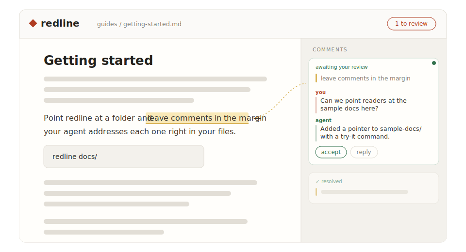
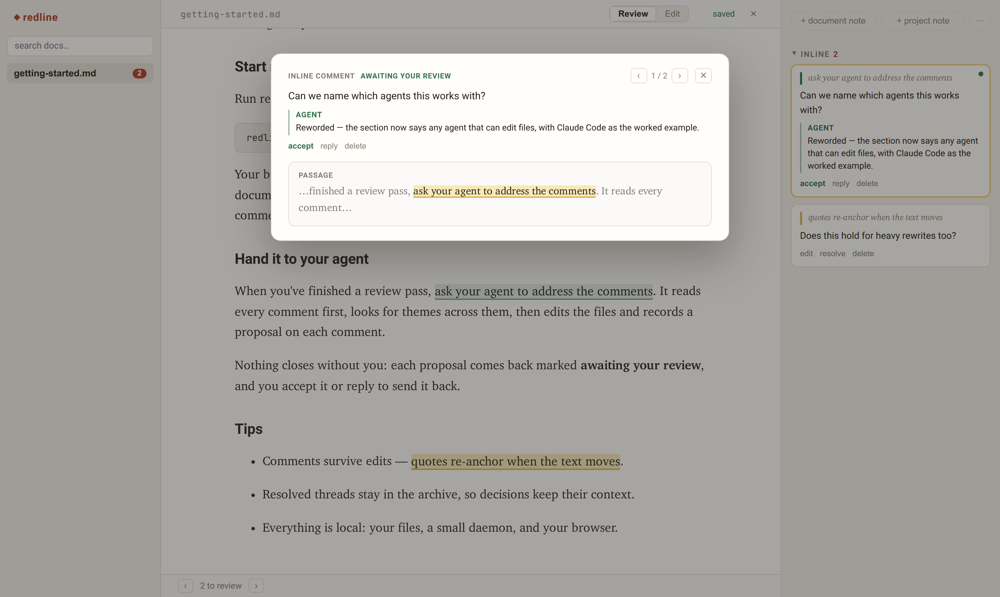
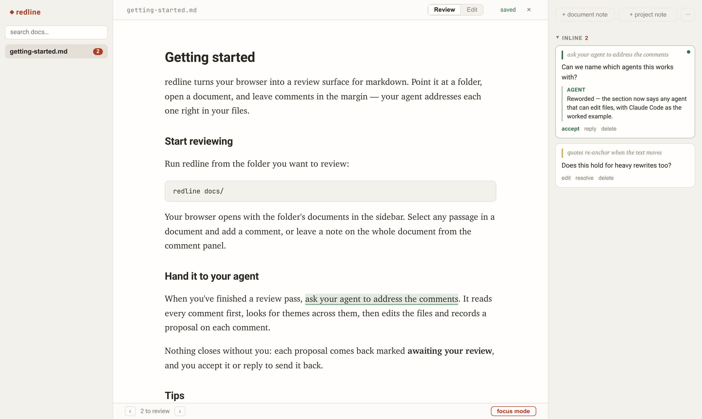

# redline

Margin comments for [markdown](https://www.markdownguide.org/getting-started/),
built for human collaboration with AI agents.

<p align="center">
  
</p>

Read documents in the browser, highlight passages, and leave
comments — the way a human reviewer marks up a draft. Your agent picks the
comments up, edits the files, and proposes resolutions. The browser updates
live as it works.

**No local agent? [Try the web version](https://domvwt.github.io/redline/)** —
nothing to install, documents stay in your browser, and the agent leg is a
copy/paste round-trip with any AI chat (ChatGPT, Copilot, Gemini, Claude).
See [The web version](#the-web-version-no-install) below.

## Setup

**The easy way**: tell your agent (Claude Code, Cowork, …) to do the setup:

> install redline from https://github.com/domvwt/redline and start it in my
> documents folder

**By hand** — one-time, from a clone of this repo:

```sh
npm install
npm run build     # builds the web UI
npm link          # puts a `redline` command on your PATH (Node's pipx-install)
```

### Start redline

From your docs directory — a repo root, a `docs/` folder, anywhere with
markdown files:

```sh
redline                 # serves the current directory and opens your browser
# → review UI:  http://127.0.0.1:5175

redline ~/other/docs    # or point it somewhere else
```

The review UI opens in your browser automatically (`--no-open` to skip
that), and the address is printed too. `--port <n>` changes the port.
redline runs entirely on your computer — nothing leaves your machine. You
can also just ask your agent to launch it for you as a background task
mid-session.

### Connect your agent (one-time, optional)

Comments live in plain JSON at `.redline/comments/<doc>.json` inside your
docs directory — any agent that can read and edit files works with those
directly, no wiring needed. For Claude Code, the skill in `skill/SKILL.md`
teaches the workflow; symlink or copy it to
`~/.claude/skills/redline-comments/` for a `/redline-comments` command.

If you want typed tools on top, register the stdio MCP server with your
agent's MCP config — for Claude Code:

```sh
claude mcp add --scope user redline -- redline mcp
```

This gives the agent `list_comments` (comments with their current anchors)
and `resolve_comment` (structured resolve/decline). The MCP client spawns
`redline mcp` on demand in the project directory — like `backlog mcp start`,
it works directly on the sidecar files, so it doesn't even need redline to
be running — no port, no per-project setup. If redline *is* running, it
notices the writes and the browser updates live.

## Using it

### Reviewing (the default mode)

1. Open <http://127.0.0.1:5175> and pick a document from the left sidebar.
2. **Highlight any passage and just type.** The comment box opens focused the
   moment your selection settles — no button to click. The document is
   read-only in Review mode, so keystrokes go to your comment.
3. **Enter** sends the comment · **Shift+Enter** for a newline · **Esc**
   cancels. The passage stays highlighted in amber.
4. Repeat across as many passages and documents as you like. Open-comment
   counts show as badges in the file tree.

While you have typed text in an open comment box, new selections are ignored
so you can't lose a half-written comment — send it or press Esc first.

Beyond passage comments:

* **Document & project notes** — the `+ document note` / `+ project note`
  buttons at the top of the sidebar create unanchored comments: thoughts about a document as
  a whole, or about the project ("add a deployment guide covering X"). The
  agent fulfills project notes by creating or restructuring documents.

* **Verdicts** — the agent never closes a comment; it proposes. A card marked
  *awaiting your review* carries the agent's note: `accept` closes it,
  `reply` sends it back with your response — the agent sees the full thread
  on the next pass.

* **Editing your comments** — `edit` on any open card rewrites its text in
  place, and your own replies inside a thread have an `edit` affordance too
  (the agent sees the updated wording on the next pass).

* **Focus mode** — `focus` in the status bar reviews everything still
  needing attention (project notes, document notes, then inline comments in
  document order) one at a time in a centred card over a dimmed backdrop:
  the conversation on top, the quoted passage in context below. `←`/`→`
  navigate, accepting slides the queue forward, replying advances to the
  next comment, `Esc` (or clicking outside) exits.

  

* **Changes** — after the agent edits a document, a `● changes` button appears in
  the header: a diff of everything since you last looked (your own edits don't
  count). `mark reviewed` acknowledges it.

* **Search** — the box above the file tree searches all documents; clicking a
  result jumps to and flashes the match.

* **Stepping through comments** — the `‹ ›` buttons in the status bar walk
  the anchored open comments in document order, centring each passage.

* **Copy for chat** — in the sidebar's `⋯` menu: puts the open comments
  (quotes, notes, threads) on the clipboard as self-contained markdown, for
  workflows that paste a review into a chat.

* **Drop or paste a document in** — drag a `.md` file onto the window, or
  paste markdown anywhere outside a text box, and it's saved into the docs
  directory (named from the file or its first heading; never overwrites)
  and opened for review.

### Handing off to the agent

Tell your agent, working in the same directory, to address your review
comments — it finds them through the MCP tools if you registered them, or by
reading `.redline/comments/*.json` directly.

With Claude Code and the bundled skill there's a shortcut:

```
/redline-comments
```

(or just say "address my review comments" in your own words; the skill
matches either.)

The agent lists the comments (each one carries your note plus the exact
quoted passage and surrounding context), reads the documents, makes the
edits, and proposes a resolution for each with a note. Because it's your
interactive session, it has the full context of whatever you've been working
on together.

Watch the browser while it works: prose changes appear live and each comment
the agent finishes turns *awaiting your review* with its note attached — the
edit is made, but the comment stays yours to close. `accept` each proposal
(or a decline you agree with), or `reply` to send it back.



### Comment lifecycle

| Status                   | Meaning                                                                                                                                                                                                        |
| ------------------------ | -------------------------------------------------------------------------------------------------------------------------------------------------------------------------------------------------------------- |
| **Open**                 | Waiting for the agent to address it.                                                                                                                                                                           |
| **Awaiting your review** | The agent proposed a resolution (with a note saying what changed) or declined with a reason. `accept` closes the comment; `reply` sends it back.                                                               |
| **Resolved**             | Closed — by you. The agent can never move a comment here.                                                                                                                                                      |
| **Unanchored**           | The passage a comment pointed at was rewritten or deleted before the comment was addressed. Never silently dropped — the original quote is preserved in the sidebar. Delete it, or re-comment on the new text. |

The sidebar is organised by scope — **Project**, **Document**, **Inline** —
with status on the cards: unresolved items first, resolved dimmed below,
unanchored marked. Clicking a comment card scrolls to and flashes its
highlight; clicking a highlight focuses its card. You can also resolve, reopen, or delete comments
manually from the sidebar.

### Edit mode

The **Review / Edit** toggle in the header switches the document to a live
Milkdown editor for quick manual touch-ups. Edits auto-save (with your
comment anchors tracked through every keystroke) — no comment affordances in
this mode; switch back to Review to comment.

Note: opening a file never rewrites it, but your **first edit** normalizes
the markdown through Milkdown's serializer (list markers, emphasis style,
wrapping may change). Work in a git repo so that first diff is deliberate.

### While the agent (or anything else) edits

A file watcher picks up every external change — the agent's edits, `git
checkout`, another editor — re-anchors your comments against the new text,
and pushes both the document and comment positions to the browser. Anchoring
is quote-based with fuzzy matching, so comments survive edits around and even
*inside* their passage; only a genuinely deleted passage unanchors.

## The web version (no install)

[domvwt.github.io/redline](https://domvwt.github.io/redline/) is the same
review UI with the daemon swapped out: documents, comments, and history live
in your browser (IndexedDB — nothing is uploaded anywhere), and instead of a
local agent editing files, you round-trip through any AI chat:

1. Drop or paste a markdown document in, review it, leave comments.
2. **copy for AI** (in the status bar) puts a self-contained prompt on your
   clipboard: the document, your comments with their quoted passages, and
   instructions for how to reply. Paste it into ChatGPT, Microsoft
   Copilot, Gemini, Claude — any assistant.
3. The assistant answers each comment and returns the revised document —
   the natural shape of a chat reply. **paste reply** brings it back:
   redline applies the new version and marks each comment *awaiting your
   review* with the assistant's response attached.
4. From there it's the normal workflow: review the diff under **● changes**,
   and `accept` or `reply` on each card.

The lifecycle rules are identical to the daemon version — the assistant only
ever proposes; closing a comment stays yours. Everything is per-browser: use
the daemon version when you want real files, git, and a hands-on-keyboard
agent.

## For developers

Architecture, the anchoring model, the MCP server, and how to work on
redline itself: see [docs/DEVELOPMENT.md](docs/DEVELOPMENT.md).

## Troubleshooting

* **Comments not appearing for the agent** — check that `.redline/comments/`
  exists in the directory the agent is working in (the MCP server and the
  skill both read it relative to the project root). Without MCP, ask the
  agent to read `.redline/comments/*.json` directly.

* **Browser not updating live** — the live connection reconnects and
  resyncs by itself, including across a redline restart. If a page somehow
  stays stale, a refresh is never wrong.

* **A comment unanchored unexpectedly** — the passage was probably rewritten
  wholesale (rewrites beyond \~20% of the quote defeat fuzzy matching, by
  design). The quote is preserved on the card; re-comment on the new text.

* **A document renders oddly** — redline renders CommonMark + GFM, the same
  dialect GitHub uses. Content outside it (YAML frontmatter, MDX, …) shows
  as literal text rather than disappearing. Also, single line breaks inside
  a paragraph join into flowing text — that's standard markdown, in every
  renderer; use a list or blank lines when you mean separate lines.

* **409 "document changed on disk"** — you edited in the browser while the
  file changed underneath (rare; external edits normally reload live).
  Refresh; external edits win.
